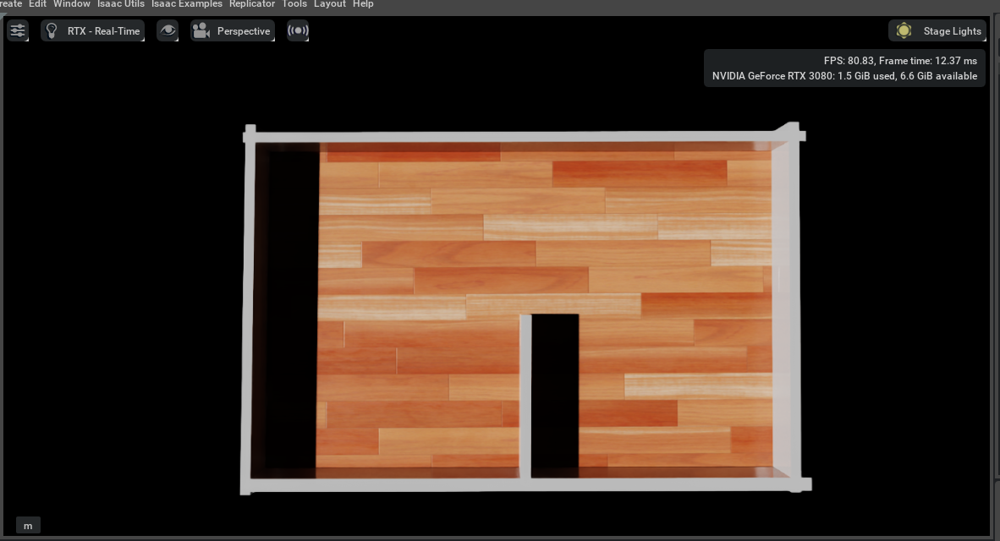
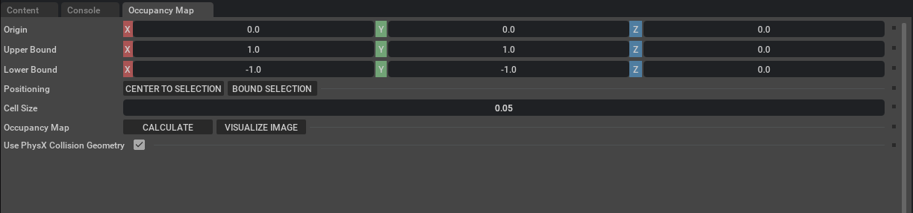
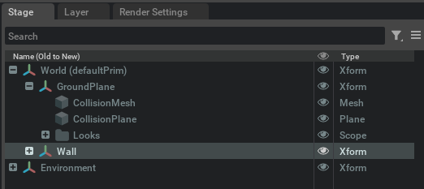
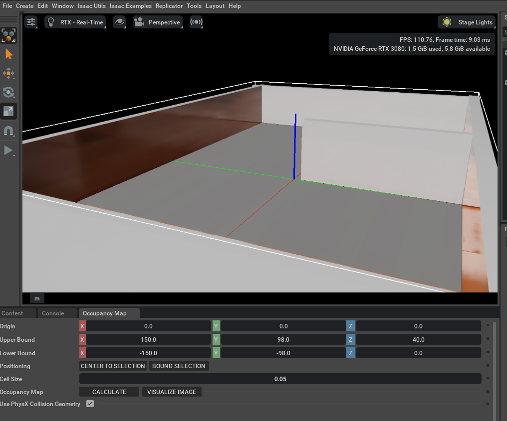
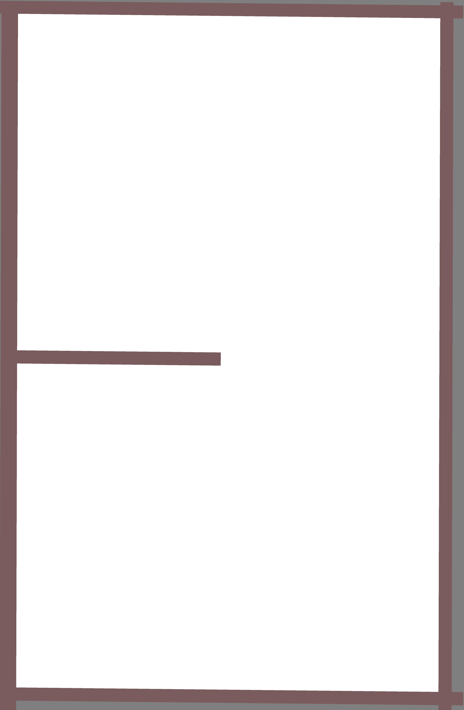

# 使用Isaacsim创建可使用的占据栅格地图
1. 建立地图的3d模型：(以该模型为例)

2. 点击`Isaac Utils`-->`Occupancy Map`，出现以下界面：

    >`Origin`中的X,Y，Z为起点坐标，默认设置为0
3. 在右侧`Stage`拦中选中需要生成占据栅格的物体（此处为`Wall`）：如下图所示：

4. 在`Occupancy Map`栏点击`BOUND SELECTION`，修改`Lower Bound`和`Upper Bound`中的**Z**值，让白框范围稍大于物体：

其中`Cell Size`为每个栅格的大小,可根据自身情况调整。
5. 点击`Occupancy Map`栏的`CALCULATE`-->`VISUALIZE IMAGE`
   - 如果生成的占据栅格地图为全白，首先确认是否为物体添加物理碰撞属性，再点击`CALCULATE`,添加物理属性操作如下：在`Stage`栏中右键物体，点击`Add`-->`physics`-->`Rigid body with colliders preset`。
    - 如果仍为空白，则在`Stage`栏中右键`GroundPlane`，选择`Deactivate`。
6. 在`Visualization`页面中，`Coordinate`栏选择`Yaml`类型，点击`RE-GENERATE IMAGE`：

复制文本栏内的内容到`.yaml`地图文件内，再`Save Image`即可。
