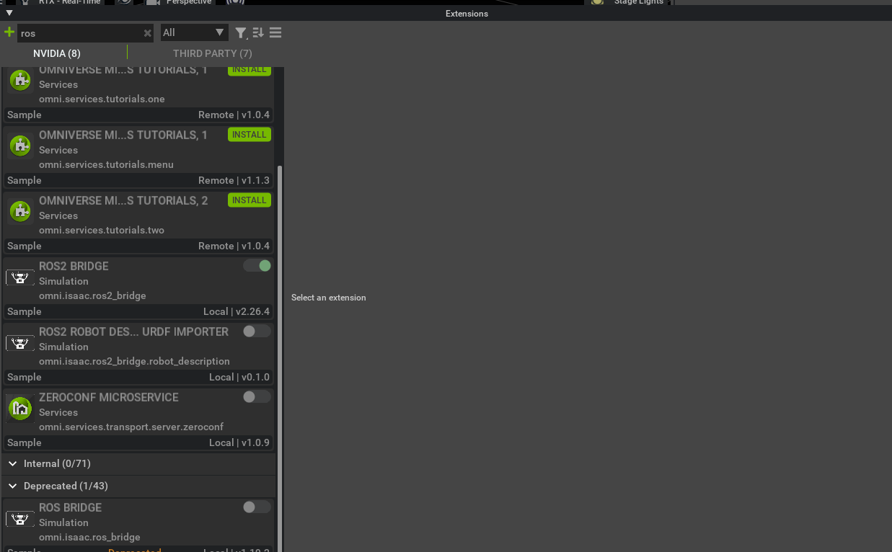
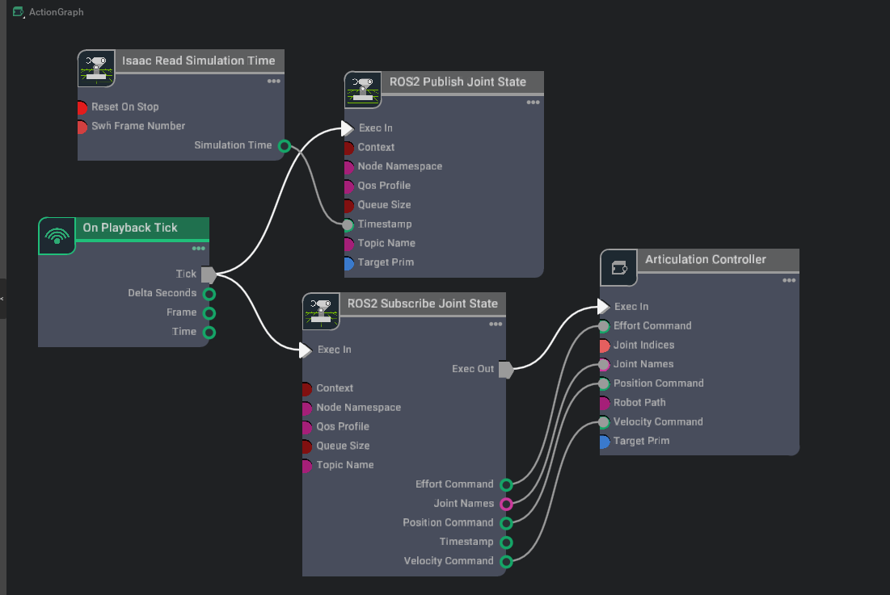
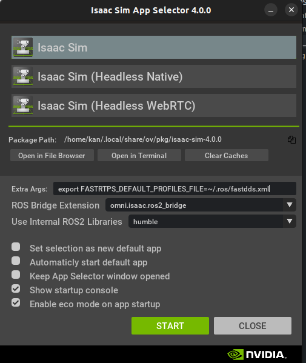

## Isaac Sim安装
- 下载并安装<a herf="https://www.nvidia.com/en-us/omniverse">Omniverse Launcher</a>.
- 在Omniverse Launcher中安装<a herf="https://docs.omniverse.nvidia.com/nucleus/latest/workstation/installation.html">Nucleus</a>.
  >!!!Note
  >1. 将<font color=red> omniverse-launcher-linux.AppImage</font>移动至文件夹中防止误删除.
  >2. 输入<font color=red>sudo chmod +x omniverse-launcher-linux.AppImage</font> 添加权限.
## Isaac-sim&Ros2 环境配置
1. 安装ROS2：
<a href ="https://docs.ros.org/en/humble/Installation/Ubuntu-Install-Debians.html">-->ROS2 Humble Ubuntu 22.04</a>

1. 安装<a herf="https://github.com/ros-perception/vision_msgs/tree/ros2">Vision_msgs_package</a>(Ros2 Bridge 接收一些消息类型（Detection2DArray and Detection3DArray used for publishing bounding boxes）的依赖)
`sudo apt install ros-humble-vision-msgs`
1. Source ROS环境
将`source /opt/ros/humble/setup.bash`加入至`~/.bashrc`中
### 启用ROS2 Bridge
- <font color=red size=5 face="微软雅黑">I.</font>使用官方的Ros2工作空间<a herf="https://github.com/isaac-sim/IsaacSim-ros_workspaces.git">IsaacSim-ros_workspaces</a>
  1. To build the ROS 2 workspace, you might need to install additional packages:
  ```
    # For rosdep install command
    sudo apt install python3-rosdep python3-rosinstall python3-rosinstall-generator python3-wstool build-essential
    # For colcon build command
    sudo apt install python3-colcon-common-extensions
  ```
  1. Resolve any package dependencies from the root of the ROS 2 workspace by running the following command:
    ```
    cd humble_ws
    rosdep install -i --from-path src --rosdistro humble -y
    ```
  2. To start using the ROS 2 packages built within this workspace, open a new terminal and source the workspace with the following commands:
    `colcon build`
    `source install/local_setup.bash`
  3. 启用ROS2 Bridge：
    - `Window`-->`Extension`
      
    `Node:ros bridge和ros2 bridge不能同时开`
- 工作空间验证：
    1. 在**Isaac sim**中`Create`-->`Isaac`-->`Robots`-->`Franka`
    2. 创建`ActionGraph`如下：
    
    >!!!Node:
    >**ROS2 Publish Joint State**和**Articalation Controller**选中**Franka**为**Target Prim**
    3. 启动`Isaac Sim`仿真
    4. 打开一个新的终端
    `cd IsaacSim-ros_workspaces`
    `cd humble` 
    `ros2 run isaac_tutorials ros2_publisher.py`

- <font color=red size=5 face="微软雅黑">II.</font>使用非官方工作空间：
  1. 在`~/.ros/`下创建`fastdds.xml`文件,将<a herf="https://github.com/isaac-sim/IsaacSim-ros_workspaces.git">IsaacSim-ros_workspaces</a>内的`fastdds.xml`内容复制过去
  ```xml
  <?xml version="1.0" encoding="UTF-8" ?>

  <license>Copyright (c) 2022-2024, NVIDIA CORPORATION.  All rights reserved.
  NVIDIA CORPORATION and its licensors retain all intellectual property
  and proprietary rights in and to this software, related documentation
  and any modifications thereto.  Any use, reproduction, disclosure or
  distribution of this software and related documentation without an express
  license agreement from NVIDIA CORPORATION is strictly prohibited.</license>

  <profiles xmlns="http://www.eprosima.com/XMLSchemas/fastRTPS_Profiles" >
      <transport_descriptors>
          <transport_descriptor>
              <transport_id>UdpTransport</transport_id>
              <type>UDPv4</type>
          </transport_descriptor>
      </transport_descriptors>

      <participant profile_name="udp_transport_profile" is_default_profile="true">
          <rtps>
              <userTransports>
                  <transport_id>UdpTransport</transport_id>
              </userTransports>
              <useBuiltinTransports>false</useBuiltinTransports>
          </rtps>
      </participant>
  </profiles>
  ```
  2. 在每个需要使用ROS2功能的终端输入:
   <font color=#DC143C>export FASTRTPS_DEFAULT_PROFILES_FILE=~/.ros/fastdds.xml</font> 
   使用`omniverse launcher`时设置如下：
   
   3. Source your ROS 2 installation and workspace before launching Isaac Sim
